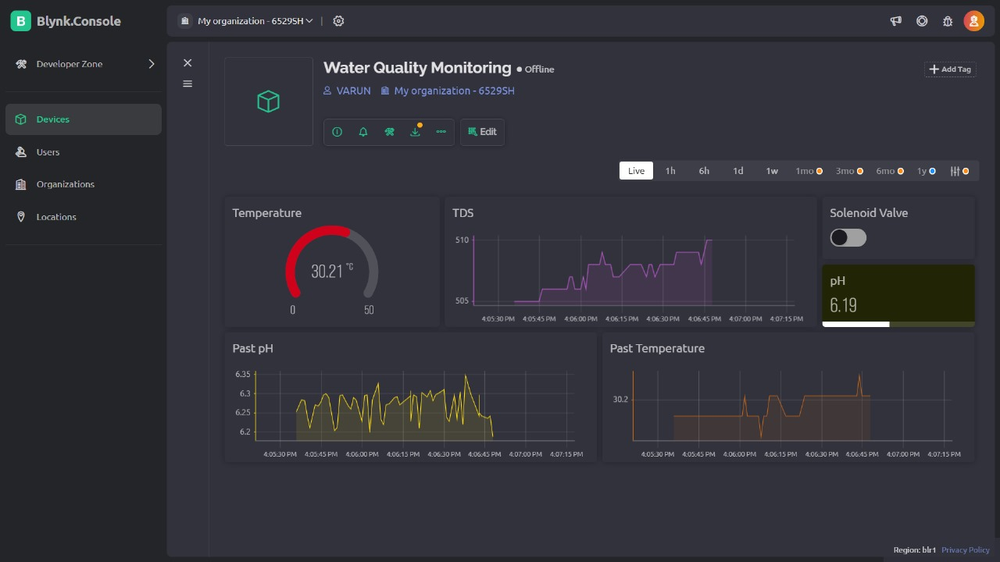

# 🌊 AquaSense: Smart Water Quality Monitoring System 🌊

Welcome to AquaSense! Your ultimate solution for real-time water quality monitoring, developed as part of the project for CS3.303 Introduction to IoT Spring '24.

## Overview

AquaSense is an innovative IoT-based system designed to track and analyze the quality of drinking water samples in real-time. With AquaSense, you can ensure that your water is always safe and clean, thanks to its advanced monitoring capabilities.

## Features

- 🔍 **Real-time Monitoring**: Keep an eye on water quality parameters such as pH level, turbidity, TDS, and temperature in real-time.
- 📊 **Blynk IoT Dashboard**: Visualize and analyze sensor data with ease using our intuitive Blynk IoT dashboard.
- 🚨 **Automated Alerts**: Receive instant alerts for any significant changes in water quality parameters, ensuring prompt action.
- 📈 **Historical Data Analysis**: Dive into historical sensor data to identify trends, patterns, and regulatory compliance.
- 🔧 **Scalability and Reliability**: Designed to scale effortlessly to meet the needs of any water monitoring network.

## Components Used

🛠 **Hardware**:
  - ESP32 microcontroller for data acquisition.
  - pH sensor, turbidity sensor, TDS sensor, and temperature sensor for precise parameter measurement.
  - Solenoid Valve for controlling the flow.

🖥 **Software Stack**:
  - Blynk IoT for creating the sleek and user-friendly dashboard interface.

## Project Demonstration

[Watch Project Demo](https://iiitaphyd-my.sharepoint.com/:v:/g/personal/varun_gup_students_iiit_ac_in/ESP-URgsV8NOpeov880dRXUBbM0NArsmWemxT46kDEo1uQ?nav=eyJyZWZlcnJhbEluZm8iOnsicmVmZXJyYWxBcHAiOiJPbmVEcml2ZUZvckJ1c2luZXNzIiwicmVmZXJyYWxBcHBQbGF0Zm9ybSI6IldlYiIsInJlZmVycmFsTW9kZSI6InZpZXciLCJyZWZlcnJhbFZpZXciOiJNeUZpbGVzTGlua0NvcHkifX0&e=Uddpeu)

## Contact

For questions or inquiries about the project, please contact [Varun Gupta](mailto:varun.gup@students.iiit.ac.in).

Let's make a splash with AquaSense! 💧💻🌟
